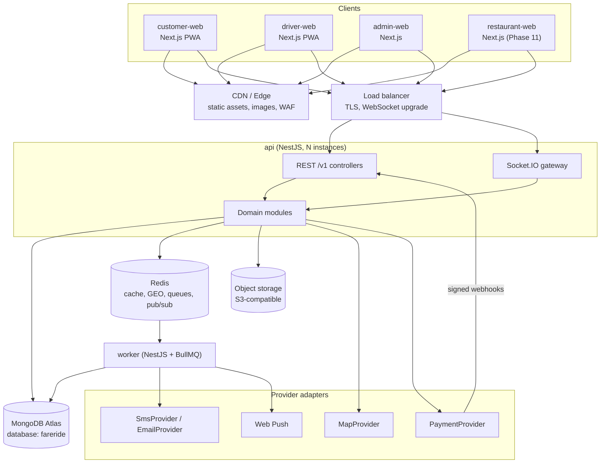
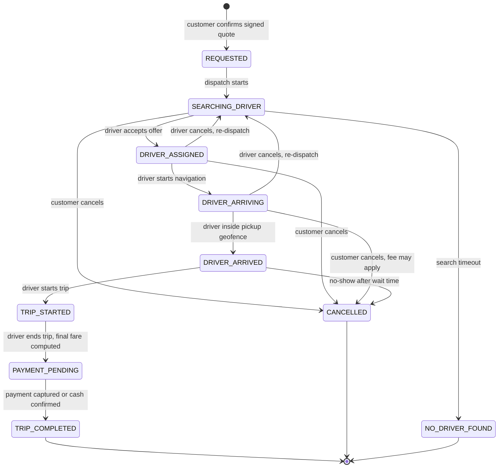
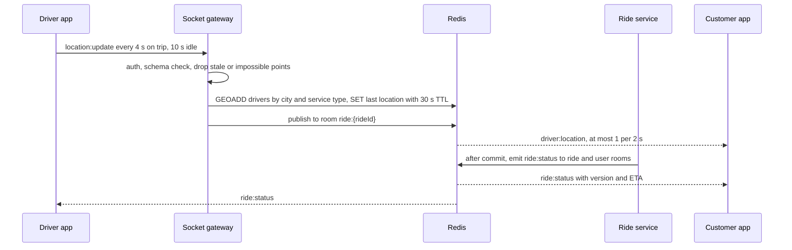
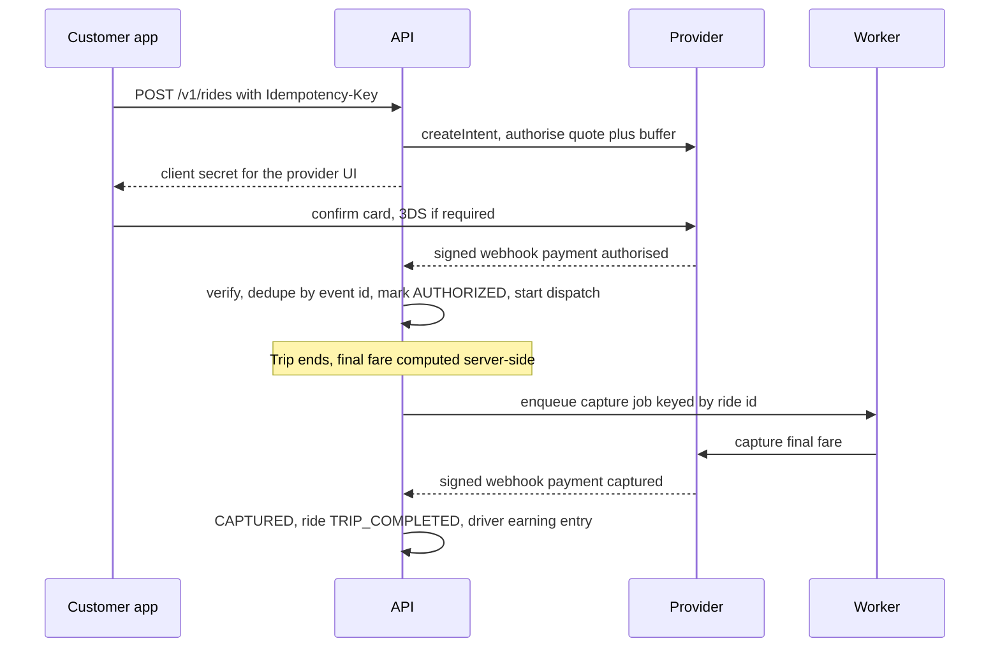
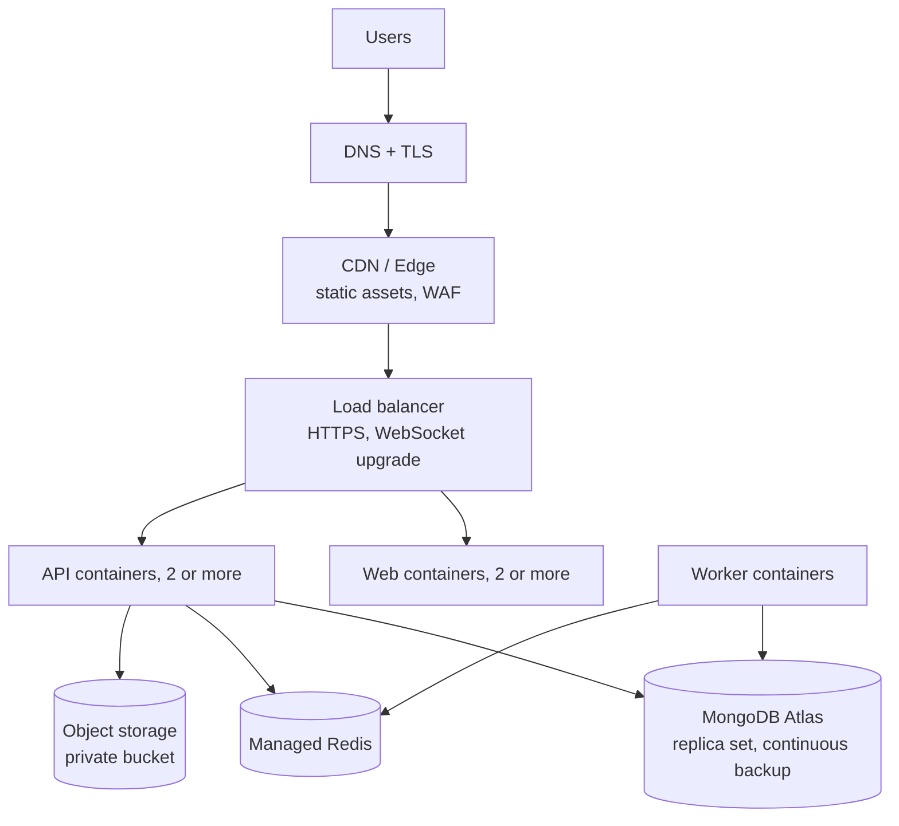

# Architecture

FareRide is a **modular monolith**: one NestJS API (REST + Socket.IO), one BullMQ worker, and separate Next.js apps per audience, in a Turborepo monorepo on MongoDB and Redis. Every boundary that may later need to scale out or be swapped (maps, payments, SMS, storage, the real-time gateway) sits behind an interface from day one. Splitting a module into its own service later is then a deployment change, not a rewrite.

Decisions with real alternatives are recorded as ADRs in [adr/](adr/). The database is MongoDB, chosen by the product owner on 2026-10-02 ([ADR 0009](adr/0009-mongodb-primary-database.md)).

## 1. System context



### Why a modular monolith

One developer, one database, one deploy, and no distributed transactions. Microservices would add service discovery, cross-service auth, distributed tracing and eventual consistency before there is a single paying user. The cost is that one hot module (location ingestion) scales with the whole API. It is already isolated behind Redis, so it is the first candidate to peel off as its own gateway service. See [ADR 0002](adr/0002-modular-monolith.md).

## 2. Backend modules

| Module          | Owns                                                | Depends on                      |
| --------------- | --------------------------------------------------- | ------------------------------- |
| `auth`          | OTP, passwords, sessions, tokens, TOTP              | users, notifications            |
| `users`         | User, Customer profile, addresses                   | —                               |
| `drivers`       | Driver profile, KYC documents, availability         | users, storage                  |
| `vehicles`      | Vehicles and their documents                        | drivers                         |
| `pricing`       | Fare rules, signed quotes, final fare               | maps                            |
| `rides`         | Ride, RideEvent, RideLocation, state machine        | pricing, dispatch, payments     |
| `dispatch`      | Nearby search, offers, timeouts                     | drivers, maps, realtime         |
| `realtime`      | Socket gateway, rooms, presence, location ingestion | auth                            |
| `payments`      | Payment, Refund, PaymentEvent, provider adapters    | wallet                          |
| `wallet`        | Wallet, WalletTransaction ledger                    | —                               |
| `promotions`    | Promotion, PromotionRedemption                      | —                               |
| `food`          | Restaurant, menus, Order, OrderItem                 | payments, delivery              |
| `delivery`      | Delivery (food and parcel), DeliveryEvent           | dispatch, payments              |
| `notifications` | Notification, push, SMS and email fan-out           | —                               |
| `support`       | SupportTicket                                       | —                               |
| `admin`         | Dashboards and admin-only queries                   | read access via module services |
| `audit`         | AuditLog                                            | —                               |

**Rules:**

1. A module owns its collections. Other modules call its service; they never query its collections directly.
2. Synchronous side effects use the in-process event bus (`@nestjs/event-emitter`). Anything slow, retryable or external goes through BullMQ.
3. Business rules that the web apps also need (state machines, fare maths, money) live in `packages/domain` as pure TypeScript with no framework imports.
4. Third parties are reached only through provider interfaces in `apps/api/src/providers`.

## 3. Frontend architecture

Each web app uses a feature-based layout:

```text
src/
├── app/                 Next.js routes (thin: compose features)
├── features/
│   ├── auth/            components/, hooks/, api/, store/, schemas/
│   ├── rides/
│   ├── maps/
│   ├── payments/
│   ├── wallet/
│   ├── notifications/
│   └── profile/
├── components/          app-level layout only (shell, nav)
├── lib/                 query client, socket client, env
└── styles/
```

| State kind   | Tool                         | Examples                                              |
| ------------ | ---------------------------- | ----------------------------------------------------- |
| Server state | TanStack Query               | Ride, history, wallet, restaurants                    |
| Client state | Zustand (small, per feature) | Booking draft, map viewport, socket connection status |
| Form state   | React Hook Form + Zod        | Login, address, KYC upload, checkout                  |
| URL state    | Search params                | Admin filters, pagination                             |

**Rendering:** Server Components for static and listing pages (restaurant lists, admin tables' first page, marketing). Client Components only where interaction or browser APIs are needed (map, booking flow, live tracking). Suspense boundaries stream slow sections; error boundaries wrap each feature.

**Main-thread budget:** socket location events are coalesced per animation frame and applied to map markers through the map library's imperative API, so a location update never re-renders React. Long lists (ride history, admin tables) are virtualised. Search inputs are debounced; map move handlers are throttled.

## 4. Maps abstraction

Business code depends on an interface, never on a vendor SDK:

```ts
interface MapProvider {
  geocode(query: string, near?: LatLng): Promise<Place[]>;
  reverseGeocode(point: LatLng): Promise<Place | null>;
  route(from: LatLng, to: LatLng, profile: TravelProfile): Promise<Route>; // distance, duration, polyline
  etaMatrix(origins: LatLng[], destination: LatLng): Promise<Duration[]>;
}
```

The browser renders with MapLibre GL through a `<Map>` component in `packages/ui` that has its own small renderer interface, so the tile source or renderer can change without touching features. Server-side routing and geocoding use a hosted API behind the `MapProvider` adapter; the API key is server-only and browser tile keys are domain-restricted.

## 5. Ride lifecycle

The authoritative state machine lives in `packages/domain/rides`. Each transition is one guarded conditional update (`findOneAndUpdate` filtered on the current status and version) plus a `rideEvents` insert, in one multi-document transaction.



| Transition                             | Allowed actor                                                              | Guard                                                                         |
| -------------------------------------- | -------------------------------------------------------------------------- | ----------------------------------------------------------------------------- |
| create → `REQUESTED`                   | Customer                                                                   | Valid unexpired quote, no other active ride, payment method usable            |
| `SEARCHING_DRIVER` → `DRIVER_ASSIGNED` | Driver (offered)                                                           | Holds the offer lock, `ONLINE`, KYC approved                                  |
| → `DRIVER_ARRIVED`                     | Assigned driver                                                            | Last known position within 150 m of pickup                                    |
| → `TRIP_STARTED`                       | Assigned driver                                                            | Status is `DRIVER_ARRIVED`                                                    |
| → `PAYMENT_PENDING`                    | Assigned driver                                                            | Status is `TRIP_STARTED`; final fare computed server-side from route and time |
| → `TRIP_COMPLETED`                     | System                                                                     | Payment captured (webhook) or cash confirmed by driver                        |
| → `CANCELLED`                          | Customer, driver (re-dispatch), system (no-show), admin (any non-terminal) | Reason required; fee computed server-side                                     |

An invalid transition returns `409 INVALID_RIDE_TRANSITION`. The food order and delivery machines follow the same pattern; see [DATABASE.md](DATABASE.md#state-enums).

## 6. Real-time

REST changes state; sockets broadcast it. Clients never change ride state over the socket. The only client-to-server socket messages are driver location pings, heartbeats and (optionally) offer responses that reuse the REST service.



- **Rooms:** `user:{userId}` (joined on connect), `ride:{rideId}` and `order:{orderId}` (joined only after an ownership check), `admin:ops`.
- **Heartbeat:** Socket.IO ping every 25 s, 20 s timeout. Clients show Live, Reconnecting or Offline.
- **Reconnect:** exponential backoff with jitter (1 s to 30 s). On reconnect the client re-joins rooms and refetches state over REST, discarding socket events whose `version` is older than what it has.
- **Missed events:** socket events are hints that invalidate TanStack Query caches. REST is the source of truth, so a lost event can delay the UI but never corrupt it.
- **Stale locations:** a driver marker greys out after 15 s without an update; dispatch ignores drivers with no ping for 30 s.
- **Scale-out:** Socket.IO Redis adapter. WebSocket-only transport so no sticky sessions are needed.

### Dispatch

1. `GEOSEARCH drivers:{cityId}:{serviceType} FROMLONLAT lng lat BYRADIUS 3 km ASC COUNT 20`.
2. Drop drivers whose last-location key has expired, who are not `ONLINE`, or who already hold an offer.
3. Rank by ETA from `MapProvider.etaMatrix` (straight-line fallback), then rating and acceptance rate.
4. Offer to one driver at a time with a 15 s TTL, guarded by a Redis lock `offer:{driverId}`. A delayed BullMQ job expires the offer and moves on. The radius widens to 5 km, then 8 km. After about 2 minutes the ride becomes `NO_DRIVER_FOUND`.
5. Acceptance is a guarded update (filtered on `status: 'SEARCHING_DRIVER'` and the ride's `version`), so two drivers racing cannot both win.

All radii, TTLs and timeouts are configuration values, not constants in code.

## 7. Payments

The API owns payment state. A payment counts as paid only after the server confirms it with the provider (signed webhook or server-side retrieve), never because the browser said so. Rides use authorise-then-capture: hold the quoted fare plus a configurable buffer at booking, capture the final fare at trip end.

```ts
interface PaymentProvider {
  readonly name: string;
  createIntent(input: CreateIntentInput, idempotencyKey: string): Promise<ProviderIntent>;
  capture(ref: ProviderRef, amount: Money, idempotencyKey: string): Promise<ProviderResult>;
  cancel(ref: ProviderRef): Promise<ProviderResult>;
  refund(ref: ProviderRef, amount: Money, idempotencyKey: string): Promise<ProviderRefund>;
  retrieve(ref: ProviderRef): Promise<ProviderIntent>;
  verifyWebhook(rawBody: Buffer, headers: Record<string, string>): ProviderEvent; // throws on a bad signature
}
```



- **Idempotency:** client `Idempotency-Key` on create; deterministic keys for capture and refund (`ride:{id}:capture`).
- **Webhooks:** raw-body signature check, stored in `PaymentEvent` with a unique provider event id, processed by the worker, 200 returned fast.
- **Reconciliation:** a nightly job re-reads non-final payments from the provider and alerts on drift.
- **Wallet:** ledger in MongoDB; the balance change and the ledger entry are written in one multi-document transaction, and the balance update is conditional so it can never go below the allowed limit. Top-ups are credited only after the capture webhook.
- **Card data** never touches FareRide servers (provider-hosted fields).

Adapters: `fake` (development and E2E tests, with controllable outcomes) and `stripe` first. Providers for the launch market are added as further adapters.

## 8. Caching

| Data                                             | Cache key                                  | TTL              | Invalidation                                                              |
| ------------------------------------------------ | ------------------------------------------ | ---------------- | ------------------------------------------------------------------------- |
| System configuration (fare rules, feature flags) | `cfg:{name}`                               | 5 min            | Explicit delete on admin change                                           |
| Driver live location                             | `driver:{id}:loc`                          | 30 s             | Overwritten by each ping; expiry marks the driver stale                   |
| Driver geo index                                 | `drivers:{cityId}:{serviceType}` (GEO set) | none             | `ZREM` on offline; sweeper removes members whose location key has expired |
| Ride offer lock                                  | `offer:{driverId}`                         | 15 s             | Deleted on accept or decline                                              |
| Fare quote                                       | not cached; the quote is a signed token    | 5 min (in token) | Expiry                                                                    |
| Restaurant list per area (Phase 11)              | `rest:list:{geohash5}:{page}`              | 60 s             | Delete on restaurant or menu change                                       |
| Restaurant menu (Phase 11)                       | `rest:menu:{id}:v{version}`                | 10 min           | Version bump on menu change                                               |
| Rate limits                                      | `rl:{route}:{subject}`                     | window length    | Expiry                                                                    |
| OTP challenge                                    | `otp:{phoneHash}`                          | 5 min            | Deleted on success or after 5 attempts                                    |
| Idempotency responses                            | `idem:{userId}:{key}`                      | 24 h             | Expiry                                                                    |
| Token version (logout everywhere)                | `tokver:{userId}`                          | 15 min           | Updated on bump                                                           |

Ride, order, wallet and payment documents are never served from cache.

## 9. Background jobs

BullMQ queues, processed by `apps/worker`. Every job has a deterministic `jobId` where duplication would be harmful, so enqueueing twice is a no-op.

| Queue           | Jobs                                                        | Retry policy                                            |
| --------------- | ----------------------------------------------------------- | ------------------------------------------------------- |
| `notifications` | push, SMS, email                                            | 5 attempts, exponential backoff                         |
| `dispatch`      | offer expiry, search timeout                                | none (time-critical; next step decides)                 |
| `payments`      | capture, refund, webhook processing, nightly reconciliation | 8 attempts, exponential backoff, alert on final failure |
| `documents`     | malware scan, image normalisation, expiry reminders         | 3 attempts                                              |
| `analytics`     | daily aggregates for dashboards                             | 3 attempts                                              |
| `cleanup`       | expired sessions, stale geo members, old idempotency keys   | 3 attempts                                              |

## 10. Deployment



- **Target:** Google Cloud (Cloud Run, Memorystore for Redis, Cloud Storage) with MongoDB Atlas, and infrastructure as code. Images are plain OCI containers, so AWS or another platform remains an option.
- **Environments:** `local` (Docker Compose), `preview` (web apps per pull request), `staging`, `production`. Configuration only through environment variables validated with Zod at boot.
- **Pipeline:** install → lint → typecheck → unit → integration (Testcontainers) → build → E2E (Playwright against Compose) → image build and scan → push. Merges to `main` deploy to staging; production deploys from a tagged release after manual approval.
- **Schema changes:** indexes are created by a release job (`syncIndexes`) before new containers take traffic; document shape changes are versioned with a `schemaVersion` field and migrated with idempotent scripts, expand-then-contract.
- **Growth path:** secondary reads for history and admin queries; split `realtime` into its own service; time-series collections and TTL indexes for location breadcrumbs; sharding by city; per-city Redis geo shards.

## 11. Micro-frontend readiness

Each audience already has its own app and can deploy independently, which delivers most of the benefit of micro-frontends. Module Federation is not used: it adds runtime coupling, shared-dependency version negotiation and harder debugging, and it pays off only when separate teams must ship parts of a single app on their own schedules. The apps share code through versioned workspace packages (`ui`, `api-client`, `domain`), which keeps that option open.

## 12. Development phases

| #   | Phase                                                                                                                                                    | Done when                               |
| --- | -------------------------------------------------------------------------------------------------------------------------------------------------------- | --------------------------------------- |
| 1   | Architecture and requirements (this document set)                                                                                                        | Approved                                |
| 2   | Monorepo setup: Turborepo, pnpm, shared configs, Compose for MongoDB and Redis, app skeletons, `/health` and `/ready`, CI (lint, typecheck, test, build) | `pnpm dev` runs all apps; CI green      |
| 3   | Design system: tokens, themes, components, a11y tests                                                                                                    | Components pass keyboard and axe checks |
| 4   | Authentication: OTP, passwords, sessions, RBAC, profile, addresses                                                                                       | Integration tests per role              |
| 5   | Customer app shell, PWA manifest                                                                                                                         | Responsive at all six widths            |
| 6   | Maps: `MapProvider`, MapLibre, search, routing                                                                                                           | Route and ETA drawn through the adapter |
| 7   | Ride booking: quotes, state machine, dispatch                                                                                                            | Every transition unit-tested            |
| 8   | Driver app: onboarding, KYC, vehicles, offers, trip actions, earnings                                                                                    | Driver completes a seeded ride          |
| 9   | Real-time tracking                                                                                                                                       | E2E: customer sees the driver move      |
| 10  | Payments, wallet, ratings                                                                                                                                | E2E: book, complete, pay, rate          |
| 11  | Food delivery, then parcels                                                                                                                              | E2E food order                          |
| 12  | Admin                                                                                                                                                    | E2E: admin approves a driver            |
| 13  | Testing gaps and all critical-flow E2E tests                                                                                                             | Critical flows green in CI              |
| 14  | Security hardening                                                                                                                                       | ASVS L2 checklist reviewed              |
| 15  | Performance                                                                                                                                              | Measured Web Vitals recorded            |
| 16  | Production Docker images                                                                                                                                 | Images build and run in CI              |
| 17  | CI/CD with deploy stages                                                                                                                                 | Staging deploys on merge                |
| 18  | Production deployment                                                                                                                                    | Public HTTPS MVP; restore drill done    |

CI starts in Phase 2 rather than Phase 17, so every later phase is gated by lint, typecheck and tests.

## 13. Complexity

Relative effort (S, M, L, XL; XL is roughly four times S). These are judgements, not measurements.

| Module                         | Size | Risk   |
| ------------------------------ | ---- | ------ |
| Dispatch and matching          | XL   | High   |
| Real-time gateway and tracking | XL   | High   |
| Payments and wallet            | XL   | High   |
| Food delivery                  | XL   | Medium |
| Ride booking and state machine | L    | Medium |
| Maps abstraction               | L    | Medium |
| Authentication and RBAC        | L    | High   |
| Admin dashboard                | L    | Low    |
| Production deployment          | L    | Medium |
| Design system                  | M    | Low    |
| Driver onboarding and KYC      | M    | Medium |
| Parcel delivery                | M    | Low    |
| Notifications                  | M    | Low    |
| Test infrastructure and E2E    | M    | Medium |
| Performance and PWA            | M    | Medium |
| Monorepo and CI foundation     | S    | Low    |
| Promotions                     | S    | Low    |
| Support tickets                | S    | Low    |
