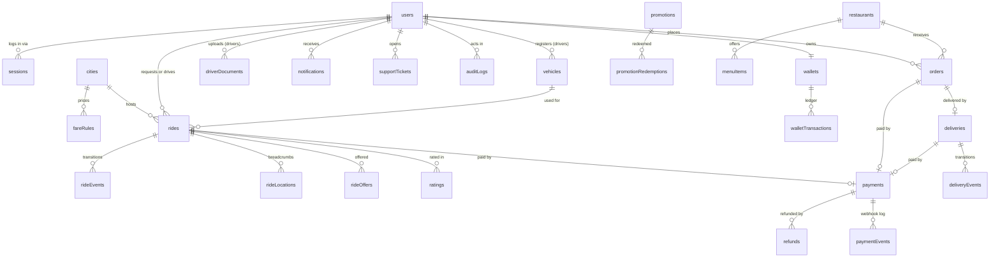

# Database

FareRide stores its data in **MongoDB**, in a dedicated `fareride` database on the owner's Atlas cluster, accessed through **Mongoose** from the NestJS API. The connection string is read only from the `MONGODB_URI` environment variable, and the database name from `MONGODB_DB_NAME` (default `fareride`), so FareRide never shares collections with other applications on the same cluster. This document is the contract the Mongoose schemas implement from Phase 2 onward.

Why MongoDB, and what it costs, is recorded in [ADR 0009](adr/0009-mongodb-primary-database.md).

## Conventions

| Convention             | Rule                                                                                                                                     |
| ---------------------- | ---------------------------------------------------------------------------------------------------------------------------------------- |
| IDs                    | `_id: ObjectId`; exposed in the API as 24-character hex strings                                                                          |
| Names                  | Collections are camelCase plurals (`rides`, `walletTransactions`); fields are camelCase                                                  |
| Timestamps             | `createdAt`, `updatedAt` (Mongoose `timestamps: true`) on every collection; event collections have `createdAt` only                      |
| Money                  | Integer minor units plus currency: `{ amountMinor: 1250, currency: 'USD' }`. Never floating point. Values are validated as safe integers |
| Phone numbers          | E.164 strings, validated with libphonenumber; default region from configuration                                                          |
| Geography              | GeoJSON `Point` (`{ type: 'Point', coordinates: [lng, lat] }`) with `2dsphere` indexes; service areas are GeoJSON `Polygon`              |
| Schema strictness      | Mongoose `strict: true` and `strictQuery: true`; every document has `schemaVersion` so shape changes can be migrated                     |
| Soft delete            | `deletedAt` only on `users`, `restaurants`, `menuItems`, `promotions`. Financial and event collections are append-only                   |
| Optimistic concurrency | `version` field on `rides`, `orders`, `deliveries`, `wallets`; every write filters on it and increments it                               |
| Transactions           | Multi-document transactions (replica set required) for anything touching money or a state transition plus its event                      |

## Embed or reference

| Data                         | Choice                                                                 | Why                                                    |
| ---------------------------- | ---------------------------------------------------------------------- | ------------------------------------------------------ |
| Customer and driver profiles | Embedded in `users` (`customerProfile`, `driverProfile`)               | Always read with the user, one-to-one                  |
| Roles                        | Embedded array `roles` in `users`                                      | Small, read on every request                           |
| Saved addresses              | Embedded array in `users` (max 20)                                     | Bounded, read with the profile                         |
| Sessions                     | Own collection `sessions`                                              | Unbounded over time, queried by token hash, TTL expiry |
| Vehicles, driver documents   | Own collections                                                        | Reviewed and queried independently by admins           |
| Ride state and timestamps    | Fields on `rides`                                                      | One document per ride, updated atomically              |
| Ride events                  | Own collection `rideEvents`                                            | Unbounded audit trail; written in the same transaction |
| Ride location breadcrumbs    | Time-series collection `rideLocations`                                 | High volume, time-ordered, expires by TTL              |
| Order items                  | Embedded in `orders` with price snapshots                              | Fixed once placed, always read with the order          |
| Menus                        | `menuCategories` embedded in `restaurants`; `menuItems` own collection | Items change independently and are searched            |
| Wallet ledger                | Own collection `walletTransactions`                                    | Append-only, unbounded                                 |

## Data model



## Collections

### Identity and access

| Collection | Key fields                                                                                                                                                                                                                                                                                                                                                                                                             | Notes                                                                                 |
| ---------- | ---------------------------------------------------------------------------------------------------------------------------------------------------------------------------------------------------------------------------------------------------------------------------------------------------------------------------------------------------------------------------------------------------------------------- | ------------------------------------------------------------------------------------- |
| `users`    | `phone`, `email`, `passwordHash`, `totpSecretEnc`, `status` (`ACTIVE`, `SUSPENDED`, `DELETED`), `roles[]` (`CUSTOMER`, `DRIVER`, `RESTAURANT`, `SUPPORT`, `ADMIN`, `SUPER_ADMIN`), `tokenVersion`, `customerProfile { displayName, avatarKey, ratingAvg, ratingCount, addresses[] }`, `driverProfile { cityId, kycStatus, availability, ratingAvg, ratingCount, acceptanceRate, approvedBy, approvedAt }`, `deletedAt` | Unique sparse indexes on `phone` and `email`; validator requires at least one of them |
| `sessions` | `userId`, `familyId`, `refreshHash`, `userAgent`, `ip`, `expiresAt`, `revokedAt`, `replacedBy`                                                                                                                                                                                                                                                                                                                         | Unique `refreshHash`; TTL index on `expiresAt`                                        |

`driverProfile.kycStatus` is `NOT_SUBMITTED`, `PENDING`, `APPROVED`, `REJECTED` or `SUSPENDED`. `driverProfile.availability` is `OFFLINE`, `ONLINE` or `ON_TRIP`, mirrored in Redis for dispatch.

### Drivers and vehicles

| Collection        | Key fields                                                                                                                                                                              | Notes                                                                                                                 |
| ----------------- | --------------------------------------------------------------------------------------------------------------------------------------------------------------------------------------- | --------------------------------------------------------------------------------------------------------------------- |
| `vehicles`        | `driverId`, `cityId`, `serviceType` (`BIKE`, `CAR`, `CAR_XL`), `make`, `model`, `colour`, `plate`, `year`, `status` (`PENDING`, `APPROVED`, `REJECTED`), `isActive`                     | Unique (`cityId`, `plate`); partial unique index on `driverId` where `isActive: true` (one active vehicle per driver) |
| `driverDocuments` | `driverId`, `vehicleId`, `type` (`LICENCE`, `ID`, `REGISTRATION`, `INSURANCE`, `PHOTO`), `storageKey`, `mime`, `sizeBytes`, `sha256`, `status`, `expiresOn`, `reviewedBy`, `reviewNote` | Files live in a private bucket                                                                                        |

### Rides

| Collection      | Key fields                                                                                                                                                                                                                                                                                                                                                                           | Notes                                                            |
| --------------- | ------------------------------------------------------------------------------------------------------------------------------------------------------------------------------------------------------------------------------------------------------------------------------------------------------------------------------------------------------------------------------------ | ---------------------------------------------------------------- |
| `cities`        | `name`, `timeZone`, `currency`, `serviceArea` (GeoJSON Polygon), `isActive`                                                                                                                                                                                                                                                                                                          | Country-specific defaults come from here, not code               |
| `fareRules`     | `cityId`, `serviceType`, `baseMinor`, `perKmMinor`, `perMinMinor`, `minimumMinor`, `bookingFeeMinor`, `cancelFeeMinor`, `commissionBps`, `effectiveFrom`                                                                                                                                                                                                                             | Edited by admins; cached                                         |
| `rides`         | `cityId`, `customerId`, `driverId`, `vehicleId`, `status`, `isActive`, `serviceType`, `pickup { point, label }`, `dropoff { point, label }`, `quoteId`, `quotedFare`, `finalFare` (Money), `distanceM`, `durationS`, `paymentMethod` (`CARD`, `WALLET`, `CASH`), `cancellation { by, reason, fee }`, `requestedAt`, `assignedAt`, `arrivedAt`, `startedAt`, `completedAt`, `version` | See invariants below                                             |
| `rideEvents`    | `rideId`, `fromStatus`, `toStatus`, `actorType` (`CUSTOMER`, `DRIVER`, `SYSTEM`, `ADMIN`), `actorId`, `metadata`, `requestId`, `createdAt`                                                                                                                                                                                                                                           | Append-only history                                              |
| `rideOffers`    | `rideId`, `driverId`, `offeredAt`, `expiresAt`, `response` (`ACCEPTED`, `DECLINED`, `EXPIRED`), `respondedAt`                                                                                                                                                                                                                                                                        | Acceptance-rate source                                           |
| `rideLocations` | time-series: `timeField: recordedAt`, `metaField: rideId`, `point`, `speedMps`, `heading`                                                                                                                                                                                                                                                                                            | Downsampled to about one point per 10 s; expires after 13 months |
| `ratings`       | `subjectType` (`RIDE`, `ORDER`), `subjectId`, `raterId`, `rateeId`, `stars` (1 to 5), `comment`                                                                                                                                                                                                                                                                                      | Unique (`subjectId`, `raterId`)                                  |

### Money

| Collection             | Key fields                                                                                                                                                                                                                                                                               | Notes                                                                                                                                                                                                                |
| ---------------------- | ---------------------------------------------------------------------------------------------------------------------------------------------------------------------------------------------------------------------------------------------------------------------------------------- | -------------------------------------------------------------------------------------------------------------------------------------------------------------------------------------------------------------------- |
| `payments`             | `subjectType` (`RIDE`, `ORDER`, `DELIVERY`, `TOPUP`), `subjectId`, `userId`, `method`, `provider`, `providerRef`, `status` (`PENDING`, `AUTHORIZED`, `CAPTURED`, `FAILED`, `CANCELLED`, `PARTIALLY_REFUNDED`, `REFUNDED`), `amount`, `captured` (Money), `idempotencyKey`, `failureCode` | Unique (`provider`, `providerRef`) and unique `idempotencyKey`                                                                                                                                                       |
| `paymentEvents`        | `provider`, `providerEventId`, `type`, `payload`, `receivedAt`, `processedAt`                                                                                                                                                                                                            | Unique (`provider`, `providerEventId`): replayed webhooks are no-ops                                                                                                                                                 |
| `refunds`              | `paymentId`, `amount`, `reason`, `status`, `providerRef`, `requestedBy`, `idempotencyKey`                                                                                                                                                                                                | Unique `idempotencyKey`                                                                                                                                                                                              |
| `wallets`              | `userId`, `currency`, `balanceMinor`, `creditLimitMinor` (default 0), `version`                                                                                                                                                                                                          | Unique `userId`. Debits are conditional updates (`balanceMinor >= amount - creditLimitMinor`), so the balance cannot pass the limit. Only driver wallets get a credit limit, to absorb commission owed on cash trips |
| `walletTransactions`   | `walletId`, `type` (`TOPUP`, `RIDE_CHARGE`, `EARNING`, `COMMISSION`, `PAYOUT`, `REFUND`, `ADJUSTMENT`), `amountMinor` (signed), `balanceAfterMinor`, `reference { type, id }`, `idempotencyKey`                                                                                          | Append-only ledger; unique `idempotencyKey`                                                                                                                                                                          |
| `promotions`           | `code`, `type` (`PERCENT`, `FIXED`), `value`, `maxDiscountMinor`, `minSpendMinor`, `serviceScope`, `startsAt`, `endsAt`, `totalLimit`, `perUserLimit`, `deletedAt`                                                                                                                       | Unique `code` with case-insensitive collation                                                                                                                                                                        |
| `promotionRedemptions` | `promotionId`, `userId`, `subjectType`, `subjectId`, `discountMinor`                                                                                                                                                                                                                     |                                                                                                                                                                                                                      |

### Food and delivery (Phase 11)

| Collection       | Key fields                                                                                                                                                                                                                                  |
| ---------------- | ------------------------------------------------------------------------------------------------------------------------------------------------------------------------------------------------------------------------------------------- |
| `restaurants`    | `cityId`, `name`, `slug` (unique), `location` (Point, `2dsphere`), `cuisineTags[]`, `isOpen`, `openingHours`, `prepTimeMin`, `ratingAvg`, `menuVersion`, `menuCategories[] { id, name, position }`, `staff[] { userId, role }`, `deletedAt` |
| `menuItems`      | `restaurantId`, `categoryId`, `name`, `description`, `priceMinor`, `imageKey`, `isAvailable`, `deletedAt`                                                                                                                                   |
| `orders`         | `customerId`, `restaurantId`, `status`, `isActive`, `items[] { menuItemId, nameSnapshot, unitPriceMinor, quantity, notes }`, `subtotal`, `deliveryFee`, `discount`, `total` (Money), `dropoff`, `version`                                   |
| `deliveries`     | `kind` (`FOOD`, `PARCEL`), `orderId`, `senderId`, `driverId`, `status`, `isActive`, `pickup`, `dropoff`, `packageDetails`, `fee`, `pinHash`, `version`                                                                                      |
| `deliveryEvents` | `deliveryId`, `fromStatus`, `toStatus`, `actorType`, `actorId`, `metadata`                                                                                                                                                                  |

### Operations

| Collection          | Key fields                                                                                                    |
| ------------------- | ------------------------------------------------------------------------------------------------------------- |
| `notifications`     | `userId`, `type`, `title`, `body`, `data`, `readAt`, `channels[]`                                             |
| `pushSubscriptions` | `userId`, `endpoint` (unique), `keys`                                                                         |
| `supportTickets`    | `userId`, `subjectType`, `subjectId`, `status`, `priority`, `assigneeId`                                      |
| `auditLogs`         | `actorId`, `actorRole`, `action`, `entityType`, `entityId`, `before`, `after`, `ip`, `requestId`, `createdAt` |
| `systemConfig`      | `_id` (the key), `value`, `updatedBy`                                                                         |

## State enums

| Machine    | States                                                                                                                                                                       |
| ---------- | ---------------------------------------------------------------------------------------------------------------------------------------------------------------------------- |
| Ride       | `REQUESTED`, `SEARCHING_DRIVER`, `DRIVER_ASSIGNED`, `DRIVER_ARRIVING`, `DRIVER_ARRIVED`, `TRIP_STARTED`, `PAYMENT_PENDING`, `TRIP_COMPLETED`, `CANCELLED`, `NO_DRIVER_FOUND` |
| Food order | `PENDING_PAYMENT`, `PLACED`, `ACCEPTED`, `PREPARING`, `READY_FOR_PICKUP`, `PICKED_UP`, `DELIVERED`, `REJECTED`, `CANCELLED`                                                  |
| Delivery   | `REQUESTED`, `SEARCHING_COURIER`, `COURIER_ASSIGNED`, `PICKED_UP`, `IN_TRANSIT`, `DELIVERED`, `CANCELLED`, `FAILED_DELIVERY`                                                 |

A food order and its delivery are two linked machines: courier search starts when the restaurant accepts, in parallel with preparation.

## Invariants the database enforces

MongoDB has no foreign keys or check constraints across documents, so the invariants that matter are enforced with unique partial indexes, conditional updates and transactions:

```js
// One active ride per customer and per driver.
// `isActive` is true for every non-terminal status and is set in the same update as `status`.
db.rides.createIndex(
  { customerId: 1 },
  { unique: true, partialFilterExpression: { isActive: true } },
);
db.rides.createIndex(
  { driverId: 1 },
  {
    unique: true,
    partialFilterExpression: { isActive: true, driverId: { $exists: true } },
  },
);

// Guarded transition (the pattern for every state change), inside a transaction with the event insert.
db.rides.findOneAndUpdate(
  { _id: rideId, status: 'SEARCHING_DRIVER', version: expectedVersion },
  {
    $set: { status: 'DRIVER_ASSIGNED', driverId, assignedAt: now },
    $inc: { version: 1 },
  },
  { returnDocument: 'after', session },
);
// null => another actor changed the ride first => 409 conflict

// Wallet debit that cannot overdraw.
db.wallets.updateOne(
  {
    _id: walletId,
    $expr: { $gte: [{ $add: ['$balanceMinor', '$creditLimitMinor'] }, amount] },
  },
  { $inc: { balanceMinor: -amount, version: 1 } },
  { session },
);
```

A JSON Schema validator on each money and ride collection also rejects documents with missing required fields or non-integer amounts, as a second line of defence behind the Mongoose schemas.

## Indexes from query patterns

| Query                     | Index                                                                         |
| ------------------------- | ----------------------------------------------------------------------------- |
| Customer ride history     | `rides { customerId: 1, createdAt: -1 }`                                      |
| Driver trips and earnings | `rides { driverId: 1, completedAt: -1 }`                                      |
| Ops: live rides           | `rides { isActive: 1, status: 1 }` (partial on `isActive: true`)              |
| Ride timeline             | `rideEvents { rideId: 1, createdAt: 1 }`                                      |
| Wallet statement          | `walletTransactions { walletId: 1, createdAt: -1 }`                           |
| Payment by subject        | `payments { subjectType: 1, subjectId: 1 }`                                   |
| KYC review queue          | `users { 'driverProfile.kycStatus': 1, updatedAt: 1 }` (partial on `PENDING`) |
| Restaurants near a point  | `restaurants { location: '2dsphere' }`                                        |
| Audit trail of an entity  | `auditLogs { entityType: 1, entityId: 1, createdAt: -1 }`                     |
| Unread notifications      | `notifications { userId: 1, createdAt: -1 }` (partial on `readAt: null`)      |
| Session expiry            | `sessions { expiresAt: 1 }` TTL                                               |

Indexes are declared on the Mongoose schemas and applied by a release job with `syncIndexes`, never by `autoIndex` in production.

## Data that does not live in MongoDB

Live driver positions, the driver geo index, offer locks, OTP challenges, rate-limit counters and idempotency responses live in Redis. Key names and TTLs are listed in [ARCHITECTURE.md section 8](ARCHITECTURE.md#8-caching).

## Environments

| Environment         | MongoDB                                                                                                                         |
| ------------------- | ------------------------------------------------------------------------------------------------------------------------------- |
| Local               | `mongo:8` in Docker Compose, started as a single-node replica set so transactions work                                          |
| CI                  | The same image as a single-node replica set                                                                                     |
| Staging, production | Atlas cluster, separate database per environment (`fareride_staging`, `fareride`), separate database users with least privilege |

## Retention

| Data                     | Retention                                                 |
| ------------------------ | --------------------------------------------------------- |
| `rideLocations`          | 13 months (time-series `expireAfterSeconds`)              |
| `paymentEvents` payloads | 18 months (TTL index)                                     |
| `auditLogs`              | 7 years (configurable to match the launch market's rules) |
| Deleted users            | Anonymised; financial records kept as legally required    |
