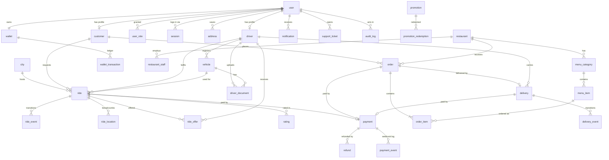

# Database

PostgreSQL 17 with PostGIS, accessed through Prisma. Migrations are Prisma migrations; geo queries use `$queryRaw` tagged templates. This document is the contract the Prisma schema implements from Phase 2 onward.

## Conventions

| Convention         | Rule                                                                                                            |
| ------------------ | --------------------------------------------------------------------------------------------------------------- |
| Primary keys       | UUIDv7 (`uuid`), generated in the application; time-ordered, so B-tree inserts stay local                       |
| Names              | `snake_case` tables and columns in SQL, mapped to `camelCase` in Prisma with `@map` / `@@map`                   |
| Timestamps         | `created_at`, `updated_at` (`timestamptz`) on every table; event tables have `created_at` only                  |
| Money              | `amount_minor BIGINT` + `currency CHAR(3)` (ISO 4217). Never floating point                                     |
| Phone numbers      | E.164 strings, validated with libphonenumber; default region from configuration                                 |
| Geography          | `geography(Point, 4326)` for points, `geography(Polygon, 4326)` for service zones                               |
| Soft delete        | `deleted_at` only on `user`, `restaurant`, `menu_item`, `promotion`. Financial and event tables are append-only |
| Optimistic locking | `version INT` on `ride`, `order`, `delivery`, `wallet`; every write checks and increments it                    |
| Enums              | PostgreSQL enums for closed sets that change with code (statuses); lookup tables for sets admins edit           |

## ER diagram



## Tables

### Identity and access

| Table       | Key columns                                                                                                                                                                                                              | Notes                                            |
| ----------- | ------------------------------------------------------------------------------------------------------------------------------------------------------------------------------------------------------------------------ | ------------------------------------------------ |
| `user`      | `id`, `phone` (unique, nullable), `email` (unique, nullable, citext), `password_hash` (nullable, Argon2id), `totp_secret_enc` (nullable), `status` (`ACTIVE`, `SUSPENDED`, `DELETED`), `token_version INT`, `deleted_at` | `CHECK (phone IS NOT NULL OR email IS NOT NULL)` |
| `user_role` | `user_id`, `role` (`CUSTOMER`, `DRIVER`, `RESTAURANT`, `SUPPORT`, `ADMIN`, `SUPER_ADMIN`)                                                                                                                                | PK (`user_id`, `role`)                           |
| `session`   | `id`, `user_id`, `family_id`, `refresh_hash` (unique), `user_agent`, `ip`, `expires_at`, `revoked_at`, `replaced_by`                                                                                                     | Refresh-token rotation and reuse detection       |
| `customer`  | `user_id` (PK), `display_name`, `avatar_key`, `default_payment_method`, `rating_avg`, `rating_count`                                                                                                                     |                                                  |
| `address`   | `id`, `user_id`, `label`, `line`, `location geography`, `place_id`                                                                                                                                                       |                                                  |

### Drivers and vehicles

| Table             | Key columns                                                                                                                                                                                                                               | Notes                                                |
| ----------------- | ----------------------------------------------------------------------------------------------------------------------------------------------------------------------------------------------------------------------------------------- | ---------------------------------------------------- |
| `driver`          | `user_id` (PK), `city_id`, `kyc_status` (`NOT_SUBMITTED`, `PENDING`, `APPROVED`, `REJECTED`, `SUSPENDED`), `availability` (`OFFLINE`, `ONLINE`, `ON_TRIP`), `rating_avg`, `rating_count`, `acceptance_rate`, `approved_by`, `approved_at` | Availability mirrored in Redis for dispatch          |
| `vehicle`         | `id`, `driver_id`, `service_type` (`BIKE`, `CAR`, `CAR_XL`), `make`, `model`, `colour`, `plate` (unique per city), `year`, `status` (`PENDING`, `APPROVED`, `REJECTED`), `is_active`                                                      | One active vehicle per driver (partial unique index) |
| `driver_document` | `id`, `driver_id`, `vehicle_id` (nullable), `type` (`LICENCE`, `ID`, `REGISTRATION`, `INSURANCE`, `PHOTO`), `storage_key`, `mime`, `size_bytes`, `sha256`, `status`, `expires_on`, `reviewed_by`, `review_note`                           | Files live in a private bucket                       |

### Rides

| Table           | Key columns                                                                                                                                                                                                                                                                                                                                                                                                                                          | Notes                                                         |
| --------------- | ---------------------------------------------------------------------------------------------------------------------------------------------------------------------------------------------------------------------------------------------------------------------------------------------------------------------------------------------------------------------------------------------------------------------------------------------------- | ------------------------------------------------------------- |
| `city`          | `id`, `name`, `time_zone`, `currency`, `service_area geography(Polygon)`, `is_active`                                                                                                                                                                                                                                                                                                                                                                | Country-specific defaults come from here, not code            |
| `fare_rule`     | `id`, `city_id`, `service_type`, `base_minor`, `per_km_minor`, `per_min_minor`, `minimum_minor`, `booking_fee_minor`, `cancel_fee_minor`, `commission_bps`, `effective_from`                                                                                                                                                                                                                                                                         | Edited by admins; cached                                      |
| `ride`          | `id`, `city_id`, `customer_id`, `driver_id` (nullable), `vehicle_id` (nullable), `status`, `service_type`, `pickup geography`, `pickup_label`, `dropoff geography`, `dropoff_label`, `quote_id`, `quoted_fare_minor`, `final_fare_minor`, `currency`, `distance_m`, `duration_s`, `payment_method` (`CARD`, `WALLET`, `CASH`), `cancel_reason`, `cancelled_by`, `requested_at`, `assigned_at`, `arrived_at`, `started_at`, `completed_at`, `version` | See constraints below                                         |
| `ride_event`    | `id`, `ride_id`, `from_status`, `to_status`, `actor_type` (`CUSTOMER`, `DRIVER`, `SYSTEM`, `ADMIN`), `actor_id`, `metadata jsonb`, `request_id`, `created_at`                                                                                                                                                                                                                                                                                        | Append-only history                                           |
| `ride_offer`    | `id`, `ride_id`, `driver_id`, `offered_at`, `expires_at`, `response` (`ACCEPTED`, `DECLINED`, `EXPIRED`), `responded_at`                                                                                                                                                                                                                                                                                                                             | Acceptance-rate source                                        |
| `ride_location` | `ride_id`, `recorded_at`, `location geography`, `speed_mps`, `heading`                                                                                                                                                                                                                                                                                                                                                                               | Downsampled to about one point per 10 s; partitioned by month |
| `rating`        | `id`, `ride_id` or `order_id`, `rater_id`, `ratee_id`, `ratee_type`, `stars SMALLINT CHECK 1..5`, `comment`                                                                                                                                                                                                                                                                                                                                          | Unique (`ride_id`, `rater_id`)                                |

### Money

| Table                  | Key columns                                                                                                                                                                                                                                                                                                                                         | Notes                                                                                                                           |
| ---------------------- | --------------------------------------------------------------------------------------------------------------------------------------------------------------------------------------------------------------------------------------------------------------------------------------------------------------------------------------------------- | ------------------------------------------------------------------------------------------------------------------------------- |
| `payment`              | `id`, `subject_type` (`RIDE`, `ORDER`, `DELIVERY`, `TOPUP`), `subject_id`, `user_id`, `method`, `provider`, `provider_ref` (unique per provider), `status` (`PENDING`, `AUTHORIZED`, `CAPTURED`, `FAILED`, `CANCELLED`, `PARTIALLY_REFUNDED`, `REFUNDED`), `amount_minor`, `captured_minor`, `currency`, `idempotency_key` (unique), `failure_code` |                                                                                                                                 |
| `payment_event`        | `id`, `provider`, `provider_event_id`, `type`, `payload jsonb`, `received_at`, `processed_at`                                                                                                                                                                                                                                                       | Unique (`provider`, `provider_event_id`): replayed webhooks are no-ops                                                          |
| `refund`               | `id`, `payment_id`, `amount_minor`, `reason`, `status`, `provider_ref`, `requested_by`, `idempotency_key` (unique)                                                                                                                                                                                                                                  |                                                                                                                                 |
| `wallet`               | `id`, `user_id` (unique), `currency`, `balance_minor`, `credit_limit_minor` (default 0), `version`                                                                                                                                                                                                                                                  | `CHECK (balance_minor >= -credit_limit_minor)`; only driver wallets get a credit limit, to absorb commission owed on cash trips |
| `wallet_transaction`   | `id`, `wallet_id`, `type` (`TOPUP`, `RIDE_CHARGE`, `EARNING`, `COMMISSION`, `PAYOUT`, `REFUND`, `ADJUSTMENT`), `amount_minor` (signed), `balance_after_minor`, `reference_type`, `reference_id`, `idempotency_key` (unique)                                                                                                                         | Append-only ledger                                                                                                              |
| `promotion`            | `id`, `code` (unique, citext), `type` (`PERCENT`, `FIXED`), `value`, `max_discount_minor`, `min_spend_minor`, `service_scope`, `starts_at`, `ends_at`, `total_limit`, `per_user_limit`, `deleted_at`                                                                                                                                                |                                                                                                                                 |
| `promotion_redemption` | `id`, `promotion_id`, `user_id`, `ride_id` or `order_id`, `discount_minor`                                                                                                                                                                                                                                                                          |                                                                                                                                 |

### Food and delivery (Phase 11)

| Table              | Key columns                                                                                                                                                                                               |
| ------------------ | --------------------------------------------------------------------------------------------------------------------------------------------------------------------------------------------------------- |
| `restaurant`       | `id`, `city_id`, `name`, `slug` (unique), `location geography`, `cuisine_tags text[]`, `is_open`, `opening_hours jsonb`, `prep_time_min`, `rating_avg`, `menu_version`, `deleted_at`                      |
| `restaurant_staff` | `restaurant_id`, `user_id`, `role` (`OWNER`, `MANAGER`, `STAFF`)                                                                                                                                          |
| `menu_category`    | `id`, `restaurant_id`, `name`, `position`                                                                                                                                                                 |
| `menu_item`        | `id`, `category_id`, `name`, `description`, `price_minor`, `image_key`, `is_available`, `deleted_at`                                                                                                      |
| `order`            | `id`, `customer_id`, `restaurant_id`, `status`, `subtotal_minor`, `delivery_fee_minor`, `discount_minor`, `total_minor`, `currency`, `dropoff geography`, `version`                                       |
| `order_item`       | `id`, `order_id`, `menu_item_id`, `name_snapshot`, `unit_price_minor`, `quantity`, `notes`                                                                                                                |
| `delivery`         | `id`, `kind` (`FOOD`, `PARCEL`), `order_id` (nullable), `sender_id` (parcel), `driver_id`, `status`, `pickup geography`, `dropoff geography`, `package_details jsonb`, `fee_minor`, `pin_hash`, `version` |
| `delivery_event`   | `id`, `delivery_id`, `from_status`, `to_status`, `actor_type`, `actor_id`, `metadata jsonb`                                                                                                               |

### Operations

| Table               | Key columns                                                                                                                           |
| ------------------- | ------------------------------------------------------------------------------------------------------------------------------------- |
| `notification`      | `id`, `user_id`, `type`, `title`, `body`, `data jsonb`, `read_at`, `channels text[]`                                                  |
| `push_subscription` | `id`, `user_id`, `endpoint` (unique), `keys jsonb`                                                                                    |
| `support_ticket`    | `id`, `user_id`, `subject_type`, `subject_id`, `status`, `priority`, `assignee_id`                                                    |
| `audit_log`         | `id`, `actor_id`, `actor_role`, `action`, `entity_type`, `entity_id`, `before jsonb`, `after jsonb`, `ip`, `request_id`, `created_at` |
| `system_config`     | `key` (PK), `value jsonb`, `updated_by`                                                                                               |

## State enums

| Machine    | States                                                                                                                                                                       |
| ---------- | ---------------------------------------------------------------------------------------------------------------------------------------------------------------------------- |
| Ride       | `REQUESTED`, `SEARCHING_DRIVER`, `DRIVER_ASSIGNED`, `DRIVER_ARRIVING`, `DRIVER_ARRIVED`, `TRIP_STARTED`, `PAYMENT_PENDING`, `TRIP_COMPLETED`, `CANCELLED`, `NO_DRIVER_FOUND` |
| Food order | `PENDING_PAYMENT`, `PLACED`, `ACCEPTED`, `PREPARING`, `READY_FOR_PICKUP`, `PICKED_UP`, `DELIVERED`, `REJECTED`, `CANCELLED`                                                  |
| Delivery   | `REQUESTED`, `SEARCHING_COURIER`, `COURIER_ASSIGNED`, `PICKED_UP`, `IN_TRANSIT`, `DELIVERED`, `CANCELLED`, `FAILED_DELIVERY`                                                 |

A food order and its delivery are two linked machines: courier search starts when the restaurant accepts, in parallel with preparation.

## Constraints that protect invariants

```sql
-- One active ride per customer and per driver
CREATE UNIQUE INDEX ride_one_active_per_customer ON ride (customer_id)
  WHERE status NOT IN ('TRIP_COMPLETED', 'CANCELLED', 'NO_DRIVER_FOUND');
CREATE UNIQUE INDEX ride_one_active_per_driver ON ride (driver_id)
  WHERE driver_id IS NOT NULL AND status NOT IN ('TRIP_COMPLETED', 'CANCELLED', 'NO_DRIVER_FOUND');

-- Assigned states must have a driver
ALTER TABLE ride ADD CONSTRAINT ride_driver_when_assigned CHECK (
  status IN ('REQUESTED', 'SEARCHING_DRIVER', 'CANCELLED', 'NO_DRIVER_FOUND') OR driver_id IS NOT NULL
);

-- Guarded transition (pattern used for every state change)
UPDATE ride SET status = 'DRIVER_ASSIGNED', driver_id = $driver, version = version + 1, assigned_at = now()
WHERE id = $id AND status = 'SEARCHING_DRIVER' AND version = $version;
-- 0 rows updated => 409 conflict
```

## Indexes from query patterns

| Query                     | Index                                                           |
| ------------------------- | --------------------------------------------------------------- |
| Customer ride history     | `ride (customer_id, created_at DESC)`                           |
| Driver trips and earnings | `ride (driver_id, completed_at DESC)`                           |
| Ops: live rides           | `ride (status) WHERE status NOT IN (terminal states)`           |
| Ride timeline             | `ride_event (ride_id, created_at)`                              |
| Wallet statement          | `wallet_transaction (wallet_id, created_at DESC)`               |
| Payment by subject        | `payment (subject_type, subject_id)`                            |
| KYC review queue          | `driver (kyc_status, updated_at) WHERE kyc_status = 'PENDING'`  |
| Restaurants near a point  | GIST on `restaurant (location)`                                 |
| Audit trail of an entity  | `audit_log (entity_type, entity_id, created_at DESC)`           |
| Unread notifications      | `notification (user_id, created_at DESC) WHERE read_at IS NULL` |

## Data that does not live in PostgreSQL

Live driver positions, the driver geo index, offer locks, OTP challenges, rate-limit counters and idempotency responses live in Redis. Key names and TTLs are listed in [ARCHITECTURE.md section 8](ARCHITECTURE.md#8-caching).

## Retention

| Data                     | Retention                                                 |
| ------------------------ | --------------------------------------------------------- |
| `ride_location`          | 13 months, then dropped by partition                      |
| `payment_event` payloads | 18 months                                                 |
| `audit_log`              | 7 years (configurable to match the launch market's rules) |
| Deleted users            | Anonymised; financial records kept as legally required    |
