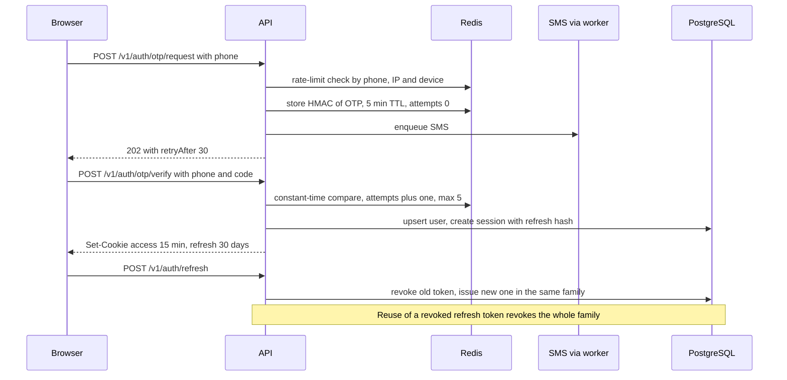

# Security

The server is the only authority. It validates every input, authorizes every action against role and ownership, and computes every price, state and balance. FareRide targets **OWASP ASVS level 2**.

## Reporting a vulnerability

Please do not open a public issue. Email the maintainer (see the GitHub profile of the repository owner) with steps to reproduce. You will get an acknowledgement within a few days.

## Authentication

| Element                   | Design                                                                                                                                                            |
| ------------------------- | ----------------------------------------------------------------------------------------------------------------------------------------------------------------- |
| Customer and driver login | Phone + OTP. Email + password optional for customers                                                                                                              |
| Staff login               | Email + password + TOTP, required for `SUPPORT`, `ADMIN`, `SUPER_ADMIN`                                                                                           |
| Password hashing          | Argon2id (memory 19 MiB, iterations 2, parallelism 1), minimum length 12 for staff                                                                                |
| OTP                       | 6 digits from a CSPRNG, stored as an HMAC, 5 min TTL, 5 attempts, 30 s resend cooldown, daily caps per phone and per IP, per-country SMS caps against SMS pumping |
| Access token              | JWT signed with EdDSA, 15 min, claims `sub`, `roles`, `sid`, `ver`. Asymmetric so the worker and gateway verify without the private key                           |
| Refresh token             | 256-bit opaque, stored hashed, 30 days, rotated on every use, family revoked on reuse                                                                             |
| Cookies                   | `HttpOnly; Secure; SameSite=Lax`, refresh cookie scoped to `/v1/auth`. API served on the same site as the web apps                                                |
| CSRF                      | SameSite cookies plus a double-submit token on cookie-authenticated mutations. Webhooks are exempt and verified by signature                                      |
| Logout everywhere         | `user.token_version` bumped; tokens carrying an older `ver` are rejected                                                                                          |
| WebSocket                 | Access token verified on handshake; socket closed at token expiry unless re-authenticated                                                                         |

## Authorization

- Roles: `CUSTOMER`, `DRIVER`, `RESTAURANT`, `SUPPORT`, `ADMIN`, `SUPER_ADMIN`, stored in `user_role`.
- Every controller is **deny by default**: a route without an explicit `@Roles()` or `@Public()` decorator fails a CI check.
- Ownership policies run in services: a customer reads only their rides, a driver acts only on rides assigned to them, restaurant staff see only their restaurant's orders.
- Drivers can go online only with `kyc_status = APPROVED` and an approved active vehicle.
- Integration tests call every endpoint as every role and assert the expected allow or deny.
- Next.js middleware route protection exists for user experience only.

## Threats and controls

| Threat                            | Control                                                                                                                               |
| --------------------------------- | ------------------------------------------------------------------------------------------------------------------------------------- |
| Broken access control             | Deny-by-default guards, ownership policies, role matrix tests                                                                         |
| Credential stuffing and OTP abuse | Rate limits, attempt caps, hashed OTPs, SMS caps, optional CAPTCHA after repeated failures                                            |
| Token theft                       | HttpOnly cookies, short access tokens, refresh rotation with reuse detection, session list with revoke                                |
| Price or state tampering          | Signed fare quotes (HMAC, 5 min), server-computed fares and fees, guarded state transitions                                           |
| Payment fraud                     | Server-side verification via webhooks or provider retrieve, idempotency keys, nightly reconciliation                                  |
| XSS                               | React escaping, no raw HTML without sanitising, strict nonce-based CSP, Trusted Types where supported                                 |
| Injection                         | Prisma parameterised queries; raw SQL only via tagged templates; lint rule against string-built SQL                                   |
| Malicious uploads                 | Presigned uploads to a private bucket, MIME and magic-byte checks, 10 MB cap, malware scan job, short-lived signed download URLs      |
| Location privacy                  | Exact positions visible only to the matched party during an active trip; the nearby-drivers endpoint returns jittered, ID-less points |
| Secrets exposure                  | Server-only variables; CI fails if a secret-like value is in a `NEXT_PUBLIC_` variable; browser map keys are domain-restricted        |
| Transport                         | HTTPS only, HSTS, CORS allow-list of FareRide origins, WSS only                                                                       |
| Denial of service                 | Edge WAF and limits, per-route API limits, per-socket message limits, body size limits (1 MB)                                         |
| Insider misuse                    | Append-only audit log for admin actions, refunds, KYC decisions, role changes                                                         |
| Supply chain                      | Lockfile, Renovate or Dependabot, `pnpm audit` and image scanning in CI, pinned base images                                           |

## Data protection

- Phone numbers and emails are masked in logs; request bodies are never logged in full.
- Encryption at rest through the managed database, cache and bucket services; TOTP secrets are additionally encrypted at the application layer.
- Account deletion anonymises the user and keeps financial records for as long as the launch market requires.

## Secrets and configuration

- Real secrets live in the cloud secret manager and are injected at runtime. `.env.example` documents every variable without values; `.env*` files other than the example are git-ignored.
- Variables prefixed `NEXT_PUBLIC_` are public by definition and may hold only non-secret values such as the API origin or a domain-restricted map style key.

## Pre-release checklist (Phase 14)

- [ ] ASVS L2 items reviewed and gaps tracked
- [ ] Role matrix tests cover every endpoint
- [ ] CSP has no `unsafe-inline` for scripts
- [ ] Dependency and container scans clean or accepted with reasons
- [ ] Secrets rotated from development values
- [ ] Backups restored successfully in a drill
